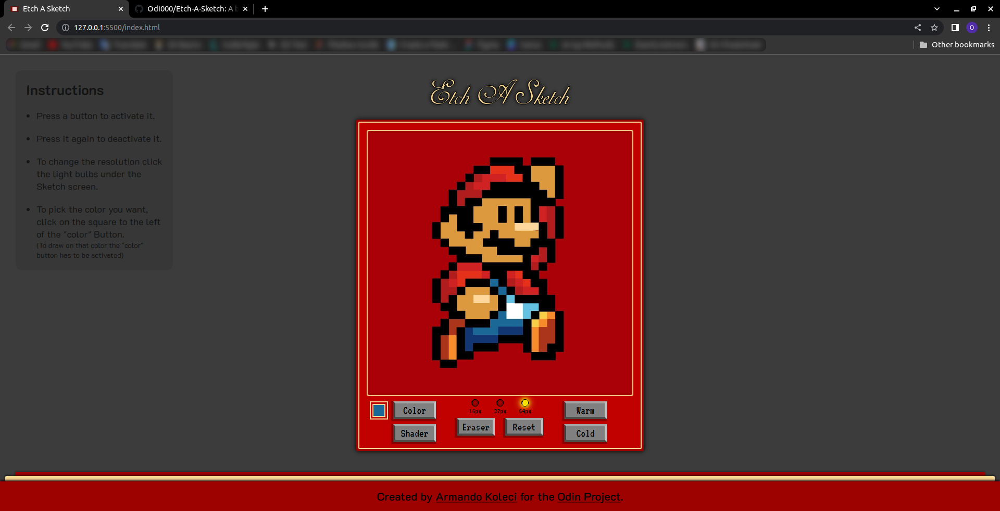
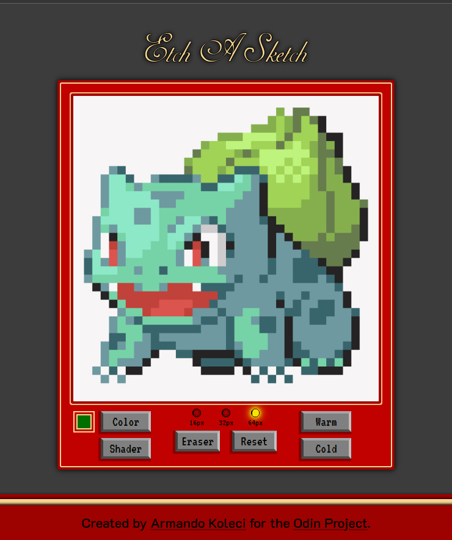
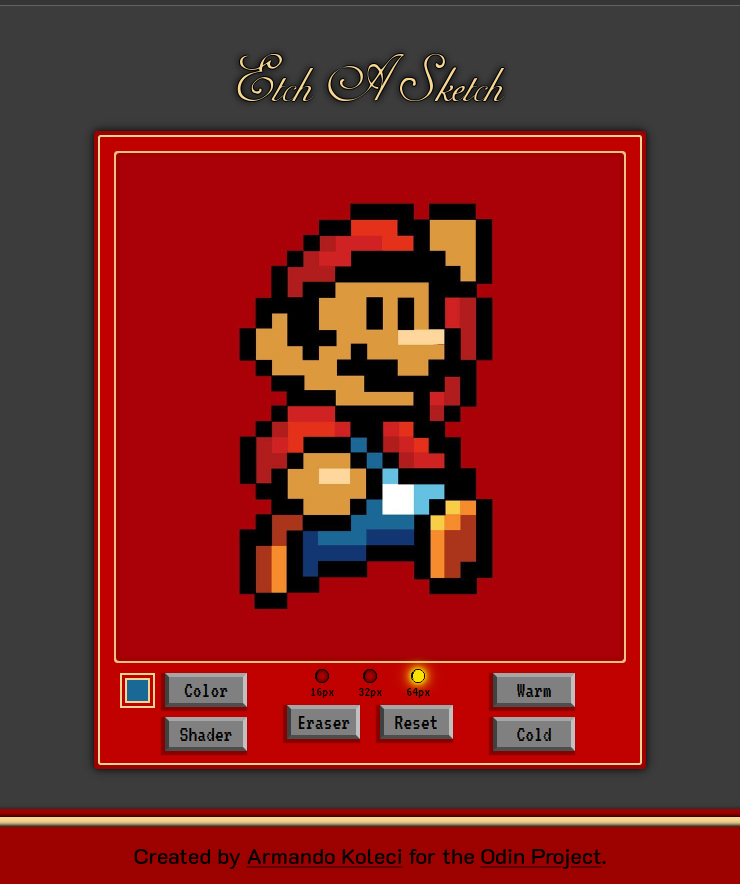
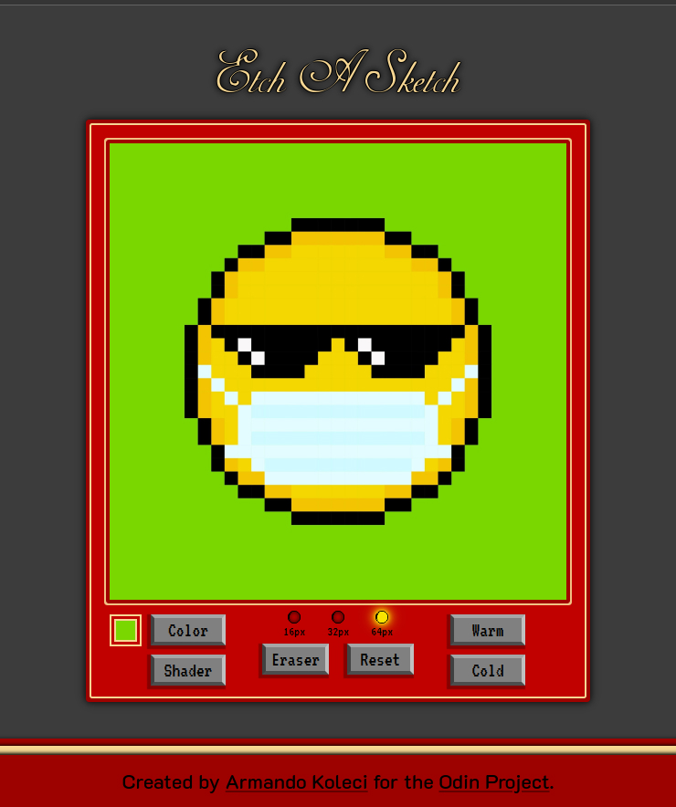

# Etch-A-Sketch

### Live Preview: &nbsp;[odi000.github.io/Etch-A-Sketch](https://odi000.github.io/Etch-A-Sketch/)

This project was created for the [Etch-a-Sketch assignment](https://www.theodinproject.com/lessons/foundations-etch-a-sketch) as part of [The Odin Project](https://www.theodinproject.com/dashboard) curriculum.

### Provided Asets

* None

### Objectives

1. Website with 16x16 grid of square `
` elements
2. Change color of each `
` on mouse-over
3. A "clear" button to clear the grid
4. Adjustable grid size, no larger than 100x100
5. (+) Option to use random color per pixel

### More Features

* Paint on click (and drag) instead of just mouse-over
* Erase painted pixels
* Grid pulse on resolution change

### Credits

* Vector graphic icons created by<a href="https://www.flaticon.com/free-icons/vector-graphic" title="vector graphic icons"> Vectoricons - Flaticon</a>
* Idea to make a 'warm' & 'cold' feature Inspired by [Moonidev](https://github.com/mooniiDev)

## Some Works

<table>
    <tr>
        <td width='245' align='center'>
            
        </td>
                <td width='245' align='center'>
            
        </td>
                <td width='245' align='center'>
            
        </td>
    </tr>
</table>